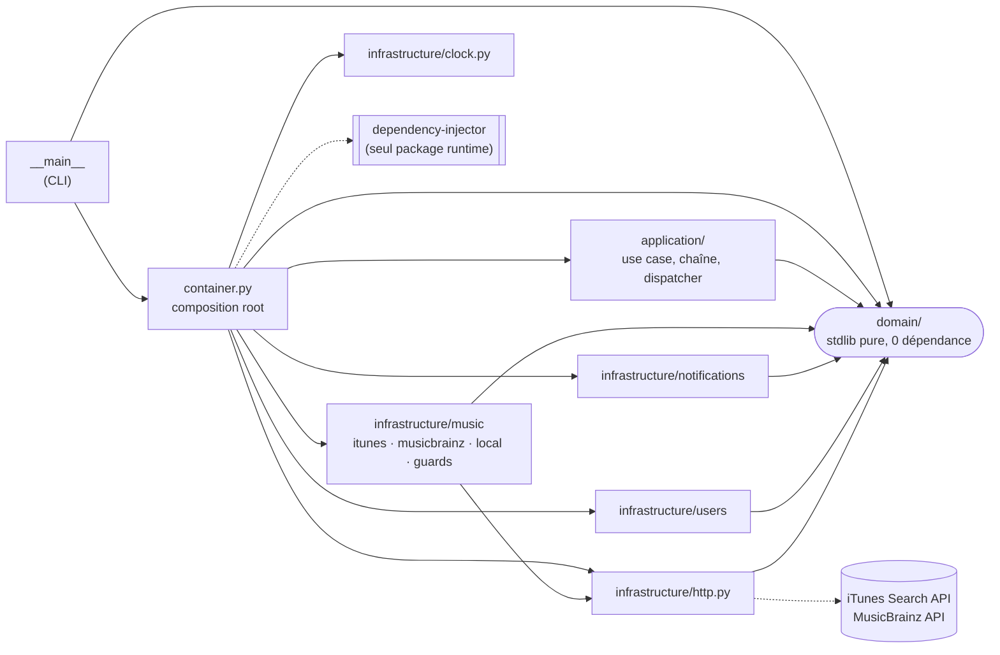

# Réveil musical

Chaque utilisateur est réveillé avec un morceau choisi selon **le jour** et **la météo**, puis prévenu sur **son canal préféré** (email, SMS, push).
Le TP porte sur l'appel déclenché à l'heure du réveil : `WakeUpUseCase.execute(user_id, jour, météo)`.

```bash
brew install python@3.13
python3.13 -m venv .venv
.venv/bin/pip install -r requirements-dev.lock && .venv/bin/pip install -e . --no-deps

.venv/bin/python -m reveil_musical u1 LUNDI SOLEIL           # un réveil (u1=email, u2=sms, u3=push)
.venv/bin/python -m reveil_musical --batch reveils.exemple.csv  # une tournée (mode de production, cf. §2)

.venv/bin/pytest                      # unitaires + contrats + architecture, sans réseau, couverture ≥ 90 % imposée
.venv/bin/pytest -m e2e --no-cov      # bout en bout contre les vraies API iTunes / MusicBrainz
scripts/audit.sh                      # licences, vulnérabilités, fraîcheur, SBOM (bloquant si copyleft ou CVE)
```

---

## 1. Des exigences métier aux choix techniques

| Exigence (sujet) | Traduction technique |
|---|---|
| Changer **vite** de fournisseur musical | Port `MusicProvider` + un **Adapter** par source. Choix et ordre des sources par la variable **`REVEIL_MUSIC_PROVIDERS`**, sans toucher au code. |
| Plusieurs **canaux** de notification, d'autres à venir | Port `NotificationSender` + un **Adapter** par SDK (3 faux SDK aux signatures différentes). `NotificationDispatcher` (**Strategy**) choisit selon le profil. |
| **Aucune** dépendance sans contrôle licence / fraîcheur | Une seule dépendance runtime. **`scripts/audit.sh`** rend le contrôle rejouable et bloquant. SBOM CycloneDX (`sbom.cdx.json`) + tableau complet (§5). Versions épinglées. |
| **Jamais** de silence | Musique : **cache → coupe-circuit → quota** devant chaque source, puis **chaîne de repli** iTunes → MusicBrainz → liste locale, **quelle que soit l'exception** d'une source (bug d'adapter compris). Canal : préféré → autres canaux de l'utilisateur → log de dernier recours, **quelle que soit l'exception** du canal. Panne non rattrapable → log `CRITICAL` + code de sortie ≠ 0. |
| Morceau selon le **jour** et la **météo** | Le service utilisateur fournit un morceau par météo + un morceau de secours. Le profil accepte en plus une **surcharge facultative (jour, météo)** : (jour, météo) → météo → secours. |

## 2. Architecture

```
            ┌─────────────────────────── container.py (composition root) ───────────────────────────┐
            │   seul fichier qui connaît les classes concrètes et les assemble (dependency-injector) │
            └────────────────────────────────────────────────────────────────────────────────────────┘
 __main__ ──►  application/                     domain/  (aucune dépendance technique)
               WakeUpUseCase ──────────────────► rules.py   : choix du morceau, formatage du message
               MusicFallbackChain ─────────────► ports.py   : MusicProvider, NotificationSender,
               NotificationDispatcher                         UserPreferencesRepository, Clock
                                                 models.py  : Track(title, artist, source), UserProfile…
               infrastructure/  ─── implémente les ports ───►
               music/ itunes · musicbrainz · local · guards (cache, coupe-circuit, quota)
               notifications/ clients (faux SDK) · adapters
               users/ in_memory (mock du service interne)   http.py (urllib)   clock.py
```

### Graphe de dépendances (J1 : « de la liste au graphe »)

Graphe tiré des imports réels du code (analyse `ast`) : on y lit le couplage, l'absence de cycle et les points d'entrée des dépendances externes.



- **Aucun cycle** ; toutes les flèches internes convergent vers `domain/`, qui ne dépend de rien.
- **Fan-in** maximal : `domain/`, dont dépendent 7 des 8 autres groupes de modules. C'est la partie la plus stable, celle qu'il faut changer le moins.
- **Une seule** entrée vers le réseau (`infrastructure/http.py`) et **une seule** vers un package externe (`container.py`) : chacune est remplaçable en un point.

Les dépendances vont toujours vers le domaine. Règles vérifiées à chaque exécution des tests (`tests/architecture/test_layers.py`) :
- `domain/` n'importe que `collections`, `dataclasses`, `enum`, `typing` ;
- `application/` n'importe ni `infrastructure`, ni le conteneur, ni un module réseau/JSON ;
- `infrastructure/` n'importe ni `application`, ni le conteneur (imports relatifs résolus) ;
- aucune classe d'`infrastructure` n'est instanciée hors de `container.py`, ni en `Classe(...)` ni en `module.Classe(...)` (« pas de `new` »).

**Aucune fuite de DTO** : le JSON iTunes (`trackName`, `trackViewUrl`…) et MusicBrainz (`title`, `artist-credit`) est converti en `Track` *dans* l'adapter. `Track` n'a que `title`, `artist`, `source` et **refuse un titre ou un artiste vide** : une réponse fournisseur sans contenu devient `ProviderUnavailable` et déclenche le repli au lieu d'un message « None — None ».

### Patterns (et le problème qu'ils règlent)

| Pattern | Où | Problème |
|---|---|---|
| Adapter | `music/itunes.py`, `music/musicbrainz.py`, `notifications/adapters.py` | API externes au format différent du modèle interne |
| Strategy | `NotificationDispatcher` | comportement d'envoi choisi au runtime selon le profil |
| Chain of Responsibility | `MusicFallbackChain` | repli ordonné entre fournisseurs |
| Decorator | `music/guards.py` | cache, coupe-circuit et quota ajoutés sans toucher aux adapters |

**Patterns volontairement écartés** (J2 : « un pattern n'est pas un objectif en soi ») :
- **Facade** : son rôle (offrir une seule méthode au-dessus de plusieurs dépendances techniques) est déjà tenu par `WakeUpUseCase.execute`, qui orchestre utilisateurs, musique et notification derrière un seul appel. Une facade de plus serait une couche vide.
- **Factory** : la création complexe est centralisée par le conteneur IoC (« IoC <> Factory, mais injecté dans la DI »). Une factory maison dupliquerait `container.py`.

### Résilience

```
morceau :  [cache → coupe-circuit → quota → iTunes] ──(panne / circuit ouvert / quota / rien trouvé / bug)──►
           [cache → coupe-circuit → quota → MusicBrainz] ──► liste locale (renvoie toujours un morceau)
canal   :  canal préféré ──(n'importe quelle exception)──► autres canaux de l'utilisateur ──► LogNotificationSender
```
- **Sources nommées** (`itunes`, `musicbrainz`, `local`) : le journal dit quelle source est en panne (`fournisseur itunes indisponible : circuit ouvert`). Un bug d'adapter est tracé avec sa trace complète, puis la chaîne passe à la source suivante.
- **Quota** (iTunes 20 req/min, MusicBrainz 1 req/s) : dépassé → `ProviderUnavailable` immédiat, on **bascule au lieu d'attendre**.
- **Coupe-circuit** (J1 : SPOF) : après 3 échecs consécutifs, la source n'est plus appelée pendant 60 s, donc on n'attend plus le timeout réseau (3 s) à chaque réveil. Ensuite, un seul appel d'essai : succès → fermé, échec → ré-ouvert.
- **Cache** placé devant : une requête connue ne consomme ni quota ni appel réseau. Les « non trouvé » sont mis en cache, les pannes non.
- **Concurrence** : l'état du cache, du quota et du coupe-circuit est protégé par un verrou (jamais pendant l'appel réseau), et tous les singletons sont des `ThreadSafeSingleton`. Un test reproduit la course : sans verrou, 50 réveils simultanés font 50 appels au lieu de 20.
- **Mode lot (`--batch`)** : cache, quota et coupe-circuit vivent dans le processus. Lancer un processus par réveil les remettrait à zéro à chaque fois. L'ordonnanceur doit donc lancer la tournée **dans un seul processus** : `--batch fichier.csv` (une ligne `user,jour,meteo`). Une ligne invalide est tracée et n'empêche pas les suivantes. Un lot vide ou illisible est une erreur, pas un succès silencieux.
- **Codes de sortie** (lus par l'ordonnanceur ; aucune erreur Python brute, toujours un message clair) :

  | Code | Signification |
  |---|---|
  | 0 | tous les réveils envoyés (éventuellement en mode dégradé) |
  | 2 | utilisateur inconnu, ou arguments invalides |
  | 1 | **réveil non livré** : panne non rattrapable (ex. service utilisateurs injoignable, tracée en `CRITICAL « RÉVEIL NON LIVRÉ »`), configuration invalide, lot vide ou illisible, ligne de lot invalide |

  Pour un lot, le code est celui du problème **le plus grave** (1 > 2 > 0) : une ligne invalide n'est pas masquée par un utilisateur inconnu.

### IoC / DI et durées de vie (`container.py`)

| Composant | Durée de vie | Raison |
|---|---|---|
| `JsonHttpClient`, `SystemClock`, adapters musique + caches + coupe-circuits + quotas, faux SDK + adapters notif, dépôt utilisateurs | **Singleton** (`ThreadSafeSingleton`) | sans état par réveil, ou état qui **doit** être partagé : un quota recréé à chaque appel ne limiterait rien. `providers.Singleton` n'est pas thread-safe. |
| `MusicFallbackChain`, `NotificationDispatcher`, `WakeUpUseCase` | **Factory (transient)** | orchestrations légères, sans état |
| Scoped | non utilisé | aucun état « par réveil » à partager |

**Dépendance captive** : un singleton ne dépend que de singletons, de la configuration ou de constantes. C'est vérifié par test, et le test échoue si l'on passe `http` en Factory.

### Configuration (dépendances implicites, rendues explicites et documentées)

Toute valeur invalide arrête le programme **au démarrage**, en nommant la variable fautive (ex. `REVEIL_HTTP_TIMEOUT : valeur invalide 'abc'`). Les durées (`REVEIL_HTTP_TIMEOUT`, `REVEIL_CACHE_TTL`) doivent être **finies et strictement positives**, car un timeout à `0`, négatif ou `nan` ferait échouer toutes les sources en silence.

| Variable | Défaut | Rôle |
|---|---|---|
| `REVEIL_MUSIC_PROVIDERS` | `itunes,musicbrainz` | sources distantes et leur ordre. La liste locale est toujours ajoutée en dernier. Un nom inconnu ou une liste vide fait **échouer le démarrage**, pas le réveil. |
| `REVEIL_ITUNES_URL` | `https://itunes.apple.com` | |
| `REVEIL_MUSICBRAINZ_URL` | `https://musicbrainz.org` | |
| `REVEIL_MUSICBRAINZ_USER_AGENT` | `ReveilMusical/0.1 ( <URL du dépôt> )` | exigé par MusicBrainz ; une URL plutôt qu'un email personnel |
| `REVEIL_HTTP_TIMEOUT` | `3.0` s | |
| `REVEIL_CACHE_TTL` | `86400` s | |

Démonstrations :
```bash
REVEIL_MUSIC_PROVIDERS=musicbrainz python -m reveil_musical u2 MARDI PLUIE            # iTunes retiré, sans toucher au code
REVEIL_ITUNES_URL=http://127.0.0.1:9 python -m reveil_musical u2 MARDI PLUIE           # iTunes en panne → MusicBrainz
REVEIL_ITUNES_URL=http://127.0.0.1:9 REVEIL_MUSICBRAINZ_URL=http://127.0.0.1:9 \
  python -m reveil_musical u3 DIMANCHE NEIGE                                            # tout en panne → liste locale
```

### Faire évoluer

- **Nouveau canal (ex. WhatsApp)** : une valeur `Channel.WHATSAPP`, un adapter qui implémente `send(contact, message)`, une ligne dans `providers.Dict` du conteneur, une ligne dans `tests/contract/test_port_contracts.py`. Le use case ne change pas.
- **Nouvelle source musicale (ex. Deezer)** : un adapter `find_track(query) -> Track | None`, une entrée dans `remote_music` du conteneur, une ligne dans le contrat. On l'active ensuite avec `REVEIL_MUSIC_PROVIDERS=deezer,itunes`.

## 3. Tests

| Dossier | Ce qui est garanti |
|---|---|
| `tests/unit/` | règles du domaine (surcharge jour, secours, invariant `Track`) ; use case avec fakes (nominal, panne musique → local, panne canal → autre canal, panne totale → dernier recours) ; cache, quota, coupe-circuit, chaîne de repli (y compris bug imprévu d'un adapter, sources nommées dans le journal), concurrence ; dispatcher (y compris exception imprévue d'un SDK) ; adapters de notification (signatures hétérogènes, SMS ≤ 160 car., contacts masqués) ; conteneur (sélection par config, durées validées, coupe-circuit câblé, durées de vie, dépendance captive, singletons thread-safe) ; CLI (codes de sortie, lot, casse) |
| `tests/contract/` | **contrats par abstraction** : la même suite pour les 6 implémentations de `MusicProvider` et les 4 de `NotificationSender`. Elle est vérifiée par mutation : un adapter qui renvoie le JSON brut fait échouer le contrat. S'y ajoutent les adapters iTunes / MusicBrainz contre des **réponses réelles enregistrées** (`tests/fixtures/`), et `JsonHttpClient` contre un serveur HTTP **local** (200, 500, HTML, timeout, hôte injoignable). |
| `tests/architecture/` | règles de couches et « pas de `new` » (§2) |
| `tests/e2e/` | vraies API iTunes et MusicBrainz, et CLI complète. Marqueur `e2e`, exclu par défaut. |

Seams utilisés : les ports du domaine ; `JsonHttpClient` (remplacé par `FakeHttp`) ; `Clock` (remplacé par `FakeClock`, pour que les tests de quota, TTL et coupe-circuit n'attendent pas) ; `container.<provider>.override(...)` pour le câblage.

## 4. Inventaire des dépendances (méthode J1)

| Dépendance | Interne / externe | Directe / transitive | Explicite / implicite | Couplage | Contrôle |
|---|---|---|---|---|---|
| iTunes Search API | externe (réseau) | directe | explicite (URL) | **faible** : 1 adapter | aucun : sans SLA, ~20 req/min |
| MusicBrainz API | externe (réseau) | directe | explicite + en-tête `User-Agent` obligatoire | **faible** : 1 adapter | aucun : 1 req/s |
| Service utilisateurs (mock) | interne | directe | explicite (port) | faible | total |
| SDK email / SMS / push (mocks) | externe simulé | directe | explicite (port) | faible : 1 adapter chacun | total (simulé) |
| `dependency-injector` | externe (package) | directe | explicite | **confiné à `container.py`** | voir §5 |
| Bibliothèque standard (`urllib`, `json`, `threading`) | externe (runtime) | directe | explicite | faible, limité à `infrastructure/` | élevé |
| `logging` (stdlib) | externe (runtime) | directe | **implicite** : configuration globale, utilisé partout | assumé : stdlib, sans état métier ; configuré une seule fois dans `__main__` | élevé |
| Variables `REVEIL_*` | — | — | **implicite** → documentées (§2) et testées | faible | total |
| Horloge système | — | — | **implicite** → port `Clock` injecté | faible | total |
| Accès réseau sortant (DNS, TLS) | externe | transitive | implicite | — | aucun, compensé par la chaîne de repli |

### Dépendances critiques (J1 : fréquence · rôle métier · contrôle)

| Dépendance | Fréquence (qui l'utilise) | Rôle métier | Contrôle | Criticité | Traitement |
|---|---|---|---|---|---|
| iTunes Search API | chaque réveil (source n°1) | trouver le morceau | **nul** (Apple, sans SLA) | 🔴 haute | Adapter, cache, coupe-circuit, quota, repli, retrait par config |
| MusicBrainz API | réveils où iTunes échoue | trouver le morceau (secours) | **nul** (MetaBrainz) | 🟠 moyenne | Adapter, cache, coupe-circuit, quota, repli local |
| Service utilisateurs | chaque réveil | profil, morceaux, canal : **indispensable** | interne | 🔴 haute | port `UserPreferencesRepository` ; panne → `CRITICAL` + code 1 pour alerter |
| SDK email / SMS / push | chaque réveil (1 canal) | prévenir l'utilisateur | nul en réel (fournisseurs tiers) | 🟠 moyenne | Adapter par SDK, repli sur les autres canaux puis log |
| `dependency-injector` | 1 fichier (`container.py`) | aucun (câblage) | open source, 1 mainteneur | 🟢 faible | confiné ; remplaçable par une composition root manuelle |
| Bibliothèque standard Python | `http.py`, `guards.py`, CLI | transport, verrous | élevé (CPython) | 🟢 faible | version supportée (3.13) |

**SPOF neutralisés** : chaque fournisseur musical et chaque canal est derrière une interface, doublé, protégé par un coupe-circuit pour la musique, et le dernier maillon (liste locale, log) ne dépend d'aucun réseau.

## 5. SBOM & audit (au 2026-10-08)

`scripts/audit.sh` fait de l'exigence légale un contrôle **rejouable**, à lancer avant chaque ajout ou mise à jour de dépendance :

| Étape | Outil | Effet |
|---|---|---|
| Licences de **tout** l'environnement (directes + transitives, runtime + dev) | `pip-licenses --fail-on "GPL;SSPL;EUPL" --partial-match` | **bloquant** (« GPL » couvre aussi AGPL et LGPL). Vérifié par mutation : installer `chardet` 5.2.0 (LGPL) fait échouer l'audit. |
| Vulnérabilités connues sur les versions exactes de `requirements-dev.lock` | `pip-audit --strict` | **bloquant** |
| Fraîcheur | `pip list --outdated` | informatif |
| SBOM CycloneDX 1.6 des **seules dépendances livrées** → `sbom.cdx.json` | `cyclonedx-bom` 7.5.0 (Apache-2.0) | lancé dans un environnement jetable : l'installer dans le projet aurait ajouté 21 paquets à auditer |

Résultat actuel : **aucune licence copyleft forte, aucune vulnérabilité connue, tous les paquets à leur dernière version stable.**

### Plateforme

| Composant | Version installée | Dernière stable | Licence | Commentaire |
|---|---|---|---|---|
| CPython | 3.13.16 | 3.14.8 | PSF-2.0 (permissive) | Le Python 3.9 du système est **en fin de vie** (oct. 2025) : écarté. 3.13 reçoit des correctifs de sécurité jusqu'en oct. 2029. Le passage à 3.14 n'est pas encore testé. |

### Tous les paquets (runtime, dev, transitifs)

| Package | Installée | Dernière stable | Licence | Usage | Lien |
|---|---|---|---|---|---|
| `dependency-injector` | 4.49.1 | 4.49.1 (à jour) | BSD-3-Clause | **runtime** | direct, **aucune transitive** |
| `pip-licenses` | 5.5.5 | 5.5.5 (à jour) | MIT | dev | direct |
| `pip_audit` | 2.10.1 | 2.10.1 (à jour) | Apache-2.0 | dev | direct |
| `pipdeptree` | 4.2.5 | 4.2.5 (à jour) | MIT | dev | direct |
| `pytest` | 9.1.1 | 9.1.1 (à jour) | MIT | dev | direct |
| `pytest-cov` | 7.1.0 | 7.1.0 (à jour) | MIT | dev | direct |
| `boolean.py` | 5.0 | 5.0 (à jour) | BSD-2-Clause | dev | transitif ← license-expression |
| `build` | 1.6.1 | 1.6.1 (à jour) | MIT | dev | transitif ← nab-project |
| `CacheControl` | 0.14.4 | 0.14.4 (à jour) | Apache-2.0 | dev | transitif ← pip_audit |
| `certifi` | 2026.7.22 | 2026.7.22 (à jour) | **MPL-2.0** ⚠️ | dev | transitif ← requests |
| `charset-normalizer` | 3.5.2 | 3.5.2 (à jour) | MIT | dev | transitif ← requests |
| `coverage` | 7.16.2 | 7.16.2 (à jour) | Apache-2.0 | dev | transitif ← pytest-cov |
| `cyclonedx-python-lib` | 11.12.0 | 11.12.0 (à jour) | Apache-2.0 | dev | transitif ← pip_audit |
| `defusedxml` | 0.7.1 | 0.7.1 (à jour) | PSF-2.0 | dev | transitif ← py-serializable |
| `filelock` | 4.0.12 | 4.0.12 (à jour) | MIT | dev | transitif ← CacheControl |
| `idna` | 3.20 | 3.20 (à jour) | BSD-3-Clause | dev | transitif ← requests |
| `iniconfig` | 2.3.1 | 2.3.1 (à jour) | MIT | dev | transitif ← pytest |
| `installer` | 1.0.1 | 1.0.1 (à jour) | MIT | dev | transitif ← nab-project |
| `license-expression` | 30.4.4 | 30.4.4 (à jour) | Apache-2.0 | dev | transitif ← cyclonedx-python-lib |
| `markdown-it-py` | 4.2.0 | 4.2.0 (à jour) | MIT | dev | transitif ← rich |
| `mdurl` | 0.1.2 | 0.1.2 (à jour) | MIT | dev | transitif ← markdown-it-py |
| `msgpack` | 1.2.3 | 1.2.3 (à jour) | Apache-2.0 | dev | transitif ← CacheControl |
| `nab` | 0.0.18 | 0.0.18 (à jour) | MIT | dev | transitif ← pipdeptree ⚠️ 0.x |
| `nab-index` | 0.0.18 | 0.0.18 (à jour) | MIT | dev | transitif ← nab, nab-project, pipdeptree |
| `nab-markersets` | 0.0.18 | 0.0.18 (à jour) | MIT | dev | transitif ← nab, nab-project, nab-provider |
| `nab-project` | 0.0.18 | 0.0.18 (à jour) | MIT | dev | transitif ← nab, pipdeptree |
| `nab-provider` | 0.0.18 | 0.0.18 (à jour) | MIT | dev | transitif ← nab, nab-index, nab-project |
| `nab-resolver` | 0.0.18 | 0.0.18 (à jour) | MIT | dev | transitif ← nab, nab-project, nab-provider |
| `packageurl-python` | 0.17.6 | 0.17.6 (à jour) | MIT | dev | transitif ← cyclonedx-python-lib |
| `packaging` | 26.3 | 26.3 (à jour) | Apache-2.0 OR BSD-2-Clause | dev | transitif ← build, nab-index, nab-project, pip-requirements-parser, pip_audit, pytest |
| `pip` | 26.2.1 | 26.2.1 (à jour) | MIT | outil | installeur du venv |
| `pip-requirements-parser` | 32.0.1 | 32.0.1 (à jour) | MIT | dev | transitif ← pip_audit |
| `pip_api` | 0.0.35 | 0.0.35 (à jour) | Apache-2.0 | dev | transitif ← pip_audit |
| `platformdirs` | 4.12.4 | 4.12.4 (à jour) | MIT | dev | transitif ← pip_audit |
| `pluggy` | 1.6.0 | 1.6.0 (à jour) | MIT | dev | transitif ← pytest, pytest-cov |
| `prettytable` | 3.18.0 | 3.18.0 (à jour) | BSD-3-Clause | dev | transitif ← pip-licenses |
| `py-serializable` | 2.1.0 | 2.1.0 (à jour) | Apache-2.0 | dev | transitif ← cyclonedx-python-lib |
| `Pygments` | 2.21.0 | 2.21.0 (à jour) | BSD-2-Clause | dev | transitif ← pytest, rich |
| `pyparsing` | 3.3.3 | 3.3.3 (à jour) | MIT | dev | transitif ← pip-requirements-parser |
| `pyproject_hooks` | 1.3.3 | 1.3.3 (à jour) | MIT | dev | transitif ← build, nab-project |
| `requests` | 2.34.2 | 2.34.2 (à jour) | Apache-2.0 | dev | transitif ← CacheControl, pip_audit |
| `rich` | 15.0.0 | 15.0.0 (à jour) | MIT | dev | transitif ← pip_audit |
| `sortedcontainers` | 2.4.0 | 2.4.0 (à jour) | Apache-2.0 | dev | transitif ← cyclonedx-python-lib |
| `tomli` | 2.5.0 | 2.5.0 (à jour) | MIT | dev | transitif ← nab, nab-project, pip_audit |
| `tomli_w` | 1.2.0 | 1.2.0 (à jour) | MIT | dev | transitif ← nab-project, pip_audit |
| `truststore` | 0.10.4 | 0.10.4 (à jour) | MIT | dev | transitif ← nab-index |
| `typing_extensions` | 4.16.0 | 4.16.0 (à jour) | PSF-2.0 | dev | transitif ← nab, nab-index, nab-project, nab-provider |
| `urllib3` | 2.8.0 | 2.8.0 (à jour) | MIT | dev | transitif ← nab-index, requests |
| `wcwidth` | 0.9.2 | 0.9.2 (à jour) | MIT | dev | transitif ← prettytable |

Tableau généré depuis `pip-licenses --with-system`, `pipdeptree --json` et `pip list --outdated`. Les licences de `dependency-injector` et de `wcwidth` ont été vérifiées dans leur fichier `LICENSE` ou leurs classifiers, car leurs métadonnées sont incomplètes.

### Politique de mise à jour (J2 : SemVer = niveau de risque)

Toutes les versions sont **épinglées exactement** (`==`), dans `pyproject.toml` et `requirements-dev.lock` : rien ne change sans décision. `scripts/audit.sh` signale les nouvelles versions, et chaque montée suit son niveau de risque :

| Montée | Exemple | Risque | Procédure |
|---|---|---|---|
| **PATCH** (x.y.**Z**) | 4.49.1 → 4.49.2 | correctifs, pas de rupture | `pytest` + `scripts/audit.sh`, puis merge |
| **MINOR** (x.**Y**.0) | 4.49 → 4.50 | nouvelles fonctions, rupture « en théorie » nulle | idem + `pytest -m e2e` + relecture du changelog |
| **MAJOR** (**X**.0.0) | 4.x → 5.0 | rupture d'API probable | audit complet (licence, transitives, changelog), branche dédiée, toutes les suites dont e2e. Pour `dependency-injector`, seul `container.py` est touché. |
| **0.x** | `nab` 0.0.18 | chaque version peut tout casser | traité comme MAJOR (outillage de dev uniquement) |

Une **correction de sécurité** (CVE remontée par `pip-audit`) passe en priorité, quel que soit son niveau.

### Points qui demandent une justification

- **`dependency-injector`, mainteneur unique (« bus factor », J2)** : on l'accepte parce que son usage est **confiné à `container.py`**. Le domaine, l'application et l'infrastructure n'en savent rien. Pour le remplacer, il suffirait de réécrire ce seul fichier en composition root manuelle, sans toucher au reste.
- **`certifi`, MPL-2.0** (copyleft *faible*, fichier par fichier) : utilisé seulement par l'outillage de dev (`pip-audit` → `requests`), **ni modifié ni distribué** avec le produit, donc sans obligation. Il est toléré par l'audit, qui ne bloque que le copyleft fort.
- **`nab*`, versions 0.0.x** (J2, SemVer : une version 0.x n'offre aucune garantie de stabilité d'API) : ce sont des dépendances de `pipdeptree`, outil de dev qui n'est pas livré. Le risque se limite à l'outillage, et les versions sont figées dans `requirements-dev.lock`.
- **Copyleft fort (GPL / AGPL / LGPL) : aucun**, ni en runtime ni en dev.
- **Limite connue** : `requirements-dev.lock` épingle les versions mais pas les **empreintes (hashes)**. Pour fermer la porte à un paquet republié sous la même version, il faudrait passer à `pip-compile --generate-hashes`.

### Services externes

| Service | Conditions | Risque (J2) | Mitigation |
|---|---|---|---|
| iTunes Search API | gratuit, sans clé, ~20 req/min, sans SLA, CGU Apple | **pricing / fin de vie** décidés seuls par Apple. **Souveraineté** : opérateur américain (Cloud Act), mais on n'envoie que le titre du morceau, aucune donnée personnelle. | Adapter isolé, cache + coupe-circuit + quota, repli automatique, retrait possible par configuration |
| MusicBrainz API | gratuit, `User-Agent` identifiable obligatoire, 1 req/s ; données principales en CC0 | **usage commercial** : MetaBrainz demande aux entreprises de soutenir le projet (plan payant). **À valider par le juridique avant la mise en production.** | Adapter isolé, quota 1 req/s, repli local |

**Données personnelles (RGPD)** : aucun contact utilisateur n'est envoyé aux fournisseurs musicaux. Les faux SDK masquent email, téléphone et jeton push dans les logs (`al***@example.com`, `+336******01`, `devi***`).

## 6. Limites connues

- La pertinence de MusicBrainz est variable : on prend le premier résultat (ex. « Purple Rain » renvoie une reprise peu connue). On pourrait filtrer par score ou par artiste.
- Le cache est en mémoire et non borné (`ponytail:` dans `guards.py`). Il est partagé sur une tournée lancée avec `--batch`, mais pas entre deux processus. Passer à un LRU ou à Redis si le volume l'exige.
- Les canaux de notification sont des mocks qui écrivent dans le log, comme le demande le sujet.
- L'ordonnancement (déclencher la tournée à la bonne heure) est hors périmètre, comme le précise le sujet.
- `docs/plan-corrections.md` retrace le plan de correction issu de la revue de conformité (sujet + cours).
